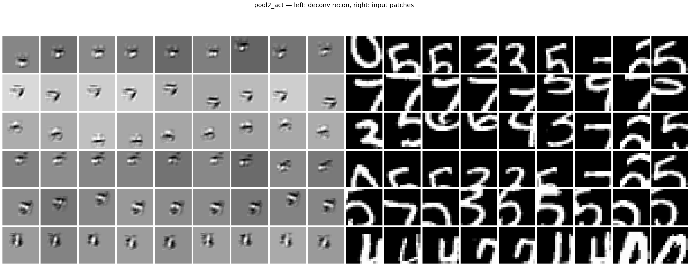

# CNN Interpretability

A reconstruction and internal visualisation of famous CNN architectures over the years using the method of Zeiler & Fergus (2013).

## 1) LeNet-5 (1998) – Dataset: MNIST

LeNet-5 is a pioneering convolutional neural network architecture designed by Yann LeCun and colleagues for handwritten digit recognition that was implemented in banking for reading cheques. The network consists of 5 layers with learnable parameters (see notebook for specifics).

### Model Architecture

```
LeNet5(
  (conv1): Conv2d(1, 6, kernel_size=(5, 5), stride=(1, 1))
  (tanh1): Tanh(a=1.7159, s=0.6667)
  (pool1): AvgPool2d(kernel_size=2, stride=2)
  (tanh2): Tanh(a=1.7159, s=0.6667)
  (conv2): Conv2d(6, 16, kernel_size=(5, 5), stride=(1, 1))
  (tanh3): Tanh(a=1.7159, s=0.6667)
  (pool2): AvgPool2d(kernel_size=2, stride=2)
  (tanh4): Tanh(a=1.7159, s=0.6667)
  (conv3): Conv2d(16, 120, kernel_size=(5, 5), stride=(1, 1))
  (tanh5): Tanh(a=1.7159, s=0.6667)
  (linear): Linear(in_features=120, out_features=84, bias=True)
  (tanh6): Tanh(a=1.7159, s=0.6667)
  (rbf): RBFOutputLayer()
)
```

### Internal Visualisations

The following images show the internal representations learned by each layer of the LeNet-5 network:

#### Convolutional Layer 1 (Conv1)

*6 filters showing edge and texture detectors learned from MNIST digits*

#### Pooling Layer 1 (Pool1)

*6 pooled feature maps showing downsampled representations from Conv1*

#### Convolutional Layer 2 (Conv2)  

*16 filters showing more complex pattern detectors combining features from Conv1*

#### Pooling Layer 2 (Pool2)

*16 pooled feature maps showing downsampled representations from Conv2*

#### Convolutional Layer 3 (Conv3)

*120 filters showing high-level digit-specific features*

### Key Features

- **Weight Initialisation**: Uses fan-in based uniform initialisation for stable training
- **Activation Function**: Scaled hyperbolic tangent (A=1.7159, S=2/3) for better gradient flow
- **Loss Function**: Custom loss combining correct class penalty with log-sum-exp regularisation
- **RBF Output**: Final layer uses learned prototypes rather than traditional softmax for better generalisation

### Implementation Details

The implementation follows the original LeCun et al. (1998) paper specifications, including:
- Hyperparameters (J=5, A=1.7159, S=2/3)
– Padding of 2 for images (32 x 32)
- Weight initialization schemes
- Custom loss function
- RBF output layer with learnable prototypes
