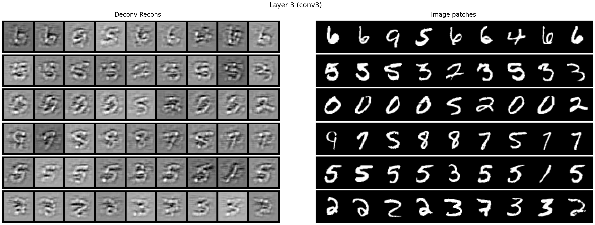
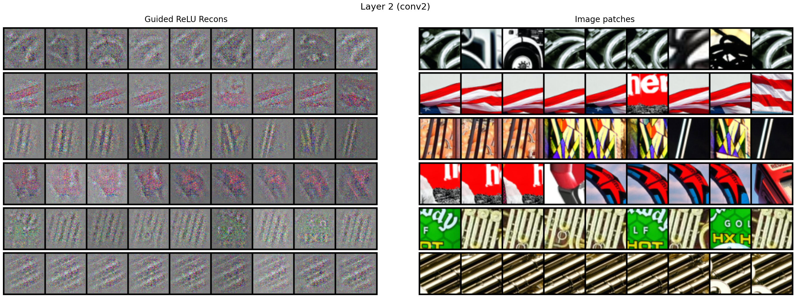
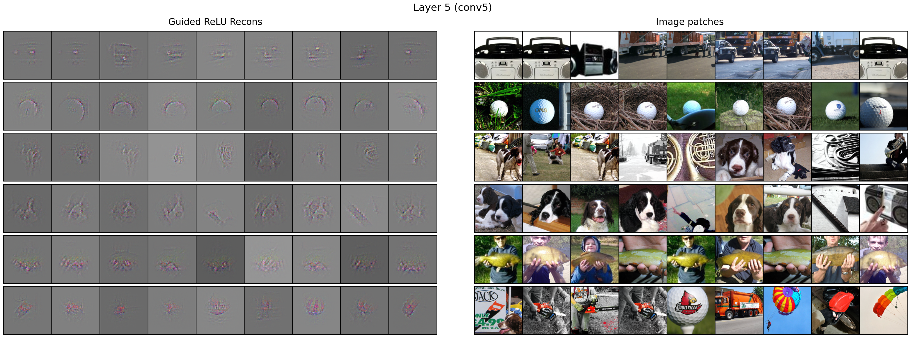
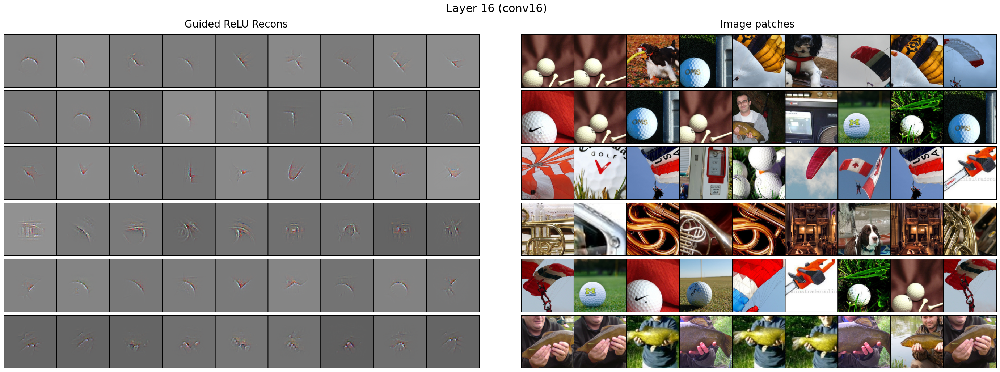
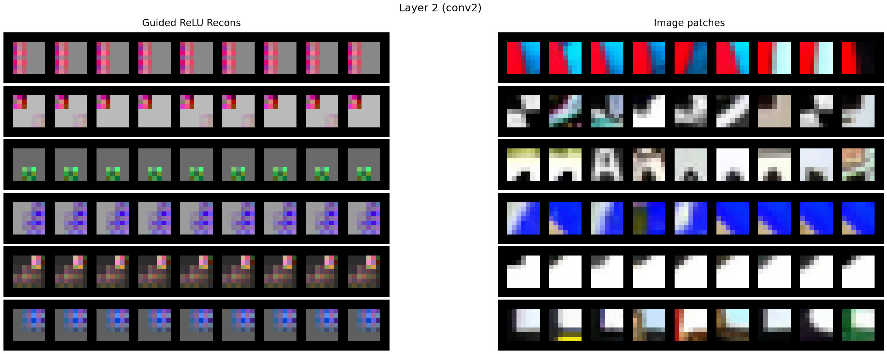

# 🫀 CNN Internals

A reconstruction and visualisation of the internal activations of famous CNN architectures over the years. Activations are projected to pixel space using Zeiler's (2011) deconvolutional network architecture or the guided backpropagation of Springenberg et al. (2015).

## 1) LeNet-5 (1998) – Dataset: MNIST

LeNet-5 is a pioneering convolutional neural network architecture designed by Yann LeCun and colleagues for the purpose of handwritten digit recognition. LeNet-5 was deployed in the banking industry for the autonomous reading of cheques. The network consists of 5 layers with learnable parameters (see notebook for full details).

### Model Architecture

```
LeNet5(
  (conv1): Conv2d(1, 6, kernel_size=(5, 5), stride=(1, 1))
  (tanh1): Tanh(a=1.7159, s=0.6667)
  (pool1): AvgPool2d(kernel_size=2, stride=2)
  (tanh2): Tanh(a=1.7159, s=0.6667)
  (conv2): Conv2d(6, 16, kernel_size=(5, 5), stride=(1, 1))
  (tanh3): Tanh(a=1.7159, s=0.6667)
  (pool2): AvgPool2d(kernel_size=2, stride=2)
  (tanh4): Tanh(a=1.7159, s=0.6667)
  (conv3): Conv2d(16, 120, kernel_size=(5, 5), stride=(1, 1))
  (tanh5): Tanh(a=1.7159, s=0.6667)
  (linear): Linear(in_features=120, out_features=84, bias=True)
  (tanh6): Tanh(a=1.7159, s=0.6667)
  (rbf): RBFOutputLayer()
)
```

### Internal Visualisations

The following images show the internal representations (top 9 activations per feature map for the first 6 channels) learned by each convolutional layer of the LeNet-5 network projected onto pixel space:

#### Convolutional Layer 1 (conv1)

*Edge detection.*

#### Convolutional Layer 2 (conv2)  

*Corner and curve detection.*

#### Convolutional Layer 3 (conv3)

*High-level digit-specific features.*

### Key Features

- **Weight Initialisation**: Uses fan-in based uniform initialisation for stable training
- **Activation Function**: Scaled hyperbolic tangent (A=1.7159, S=2/3) for better gradient flow
- **Loss Function**: Custom loss combining correct class penalty with log-sum-exp regularisation
- **RBF Output**: Final layer uses learned prototypes rather than traditional softmax for better generalisation

### Implementation Details

The implementation follows the original LeCun et al. (1998) paper specifications, including:
- Hyperparameters (J=5, A=1.7159, S=2/3)
– Padding of 2 for images (32 x 32)
- Weight initialization schemes
- Custom loss function
- RBF output layer with learnable prototypes

<br><br>

## 2) AlexNet (2012) – Dataset: Imagenette (10 class subset of ImageNet)

AlexNet is a breakthrough convolutional neural network architecture designed by Alex Krizhevsky, Ilya Sutskever, and Geoffrey Hinton. AlexNet is a deep CNN used for image clasification that marked the ascent of the deep learning era. AlexNet won the ILSVRC-2012 competition and achieved a winning top-5 test error rate of 15.3%, compared to 26.2% achieved by the second-best entry. The network consists of 8 layers with learnable parameters (see notebook for full details).

### Model Architecture

```
AlexNet(
  (conv1): Conv2d(3, 96, kernel_size=(11, 11), stride=(4, 4), padding=(2, 2))
  (relu1): ReLU()
  (lrn1): LocalResponseNorm(5, alpha=0.0005, beta=0.75, k=2)
  (pool1): MaxPool2d(kernel_size=3, stride=2, padding=0, dilation=1, ceil_mode=False)
  (conv2): Conv2d(96, 256, kernel_size=(5, 5), stride=(1, 1), padding=(2, 2))
  (relu2): ReLU()
  (lrn2): LocalResponseNorm(5, alpha=0.0005, beta=0.75, k=2)
  (pool2): MaxPool2d(kernel_size=3, stride=2, padding=0, dilation=1, ceil_mode=False)
  (conv3): Conv2d(256, 384, kernel_size=(3, 3), stride=(1, 1), padding=(1, 1))
  (relu3): ReLU()
  (conv4): Conv2d(384, 384, kernel_size=(3, 3), stride=(1, 1), padding=(1, 1))
  (relu4): ReLU()
  (conv5): Conv2d(384, 256, kernel_size=(3, 3), stride=(1, 1), padding=(1, 1))
  (relu5): ReLU()
  (pool3): MaxPool2d(kernel_size=3, stride=2, padding=0, dilation=1, ceil_mode=False)
  (lin1): Linear(in_features=9216, out_features=4096, bias=True)
  (relu6): ReLU()
  (drop1): Dropout(p=0.5, inplace=False)
  (lin2): Linear(in_features=4096, out_features=4096, bias=True)
  (relu7): ReLU()
  (drop2): Dropout(p=0.5, inplace=False)
  (lin3): Linear(in_features=4096, out_features=10, bias=True)
)
```

### Internal Visualisations

The following images show the internal representations (top 9 activations per feature map for the first 6 channels) learned by each convolutional layer of the AlexNet network projected onto pixel space using Guided Backpropagation (Springenberg et al. 2015):

#### Convolutional Layer 2 (conv2)  

*Edge and texture detection.*

#### Convolutional Layer 3 (conv3)

*Mid-level patterns composed of curved & straight lines; digit detection.*

#### Convolutional Layer 4 (conv4)

*Complex features (e.g., human fingers, partial human/dog faces, etc.).*

#### Convolutional Layer 5 (conv5)

*High level global pattern detection (e.g., full dog faces, golf balls, human hands etc.).*

### Key Features

- **Local Response Normalization (LRN)**: Applied after `relu1` and `relu2` as in the original paper
- **PCA Lighting Noise**: AlexNet-style color lighting augmentation with `alpha=0.1` using dataset PCA (`eigvals`, `eigvecs`)
- **Mean Image Subtraction + 224 crops**: Train uses RandomCropWithMeanSub(224) + horizontal flip; Val uses CenterCropWithMeanSub(224)
- **Receptive-field aligned visualisations**: Top-k activations per map with Guided Backprop patches
- **Regularisation**: Dropout `p=0.5` on the first two fully-connected layers

### Implementation Details

The implementation follows the original Krizhevsky et al. (2012) paper specifications, including:
- Preprocessing of data with mean image and RGB PCA stats; applies `Lighting(0.1, eigvals, eigvecs)`; training set uses `RandomCropWithMeanSub(224)` and random horizontal flip; val uses `CenterCropWithMeanSub(224)`
- Model follow original architecture `conv1` 96×11×11 s4 p2 → LRN → 3×3 s2 maxpool; `conv2` 256×5×5 p2 → LRN → 3×3 s2 maxpool; `conv3` 384×3×3; `conv4` 384×3×3; `conv5` 256×3×3 → 3×3 s2 maxpool; FC: 9216→4096→4096→10 with ReLU and Dropout `p=0.5`
- Normalisation with LRN with `size=5`, `alpha=5e-4`, `beta=0.75`, `k=2`
- Kaiming normal init for Conv/Linear weights; biases zero
- Guided Backprop (Springenberg et al. 2015) with custom ReLU hooks; receptive-field table to crop input-aligned patches; top-k activation tiles per feature map

<br><br>

## 3) VGG-16 (2014) – Dataset: Imagenette (10 class subset of ImageNet)

VGG-16 is one of a class of deep convolutional neural networks introduced by Simonyan and Zisserman (2015). VGG-16 features small 3×3 convolutions stacked depth-wise, leading to 13 convolutional layers followed by 3 fully-connected layers. Its simplicity and depth made it a strong baseline and influential architecture after placing first in the 2014 ImageNet Challenge.

### Model Architecture

```
VGG16(
  (conv1): Conv2d(3, 64, kernel_size=(3, 3), stride=(1, 1), padding=(1, 1))
  (relu1): ReLU()
  (conv2): Conv2d(64, 64, kernel_size=(3, 3), stride=(1, 1), padding=(1, 1))
  (relu2): ReLU()
  (pool1): MaxPool2d(kernel_size=2, stride=2)
  (conv3): Conv2d(64, 128, kernel_size=(3, 3), stride=(1, 1), padding=(1, 1))
  (relu3): ReLU()
  (conv4): Conv2d(128, 128, kernel_size=(3, 3), stride=(1, 1), padding=(1, 1))
  (relu4): ReLU()
  (pool2): MaxPool2d(kernel_size=2, stride=2)
  (conv5): Conv2d(128, 256, kernel_size=(3, 3), stride=(1, 1), padding=(1, 1))
  (relu5): ReLU()
  (conv6): Conv2d(256, 256, kernel_size=(3, 3), stride=(1, 1), padding=(1, 1))
  (relu6): ReLU()
  (conv7): Conv2d(256, 256, kernel_size=(3, 3), stride=(1, 1), padding=(1, 1))
  (relu7): ReLU()
  (pool3): MaxPool2d(kernel_size=2, stride=2)
  (conv8): Conv2d(256, 512, kernel_size=(3, 3), stride=(1, 1), padding=(1, 1))
  (relu8): ReLU()
  (conv9): Conv2d(512, 512, kernel_size=(3, 3), stride=(1, 1), padding=(1, 1))
  (relu9): ReLU()
  (conv10): Conv2d(512, 512, kernel_size=(3, 3), stride=(1, 1), padding=(1, 1))
  (relu10): ReLU()
  (pool4): MaxPool2d(kernel_size=2, stride=2)
  (conv11): Conv2d(512, 512, kernel_size=(3, 3), stride=(1, 1), padding=(1, 1))
  (relu11): ReLU()
  (conv12): Conv2d(512, 512, kernel_size=(3, 3), stride=(1, 1), padding=(1, 1))
  (relu12): ReLU()
  (conv13): Conv2d(512, 512, kernel_size=(3, 3), stride=(1, 1), padding=(1, 1))
  (relu13): ReLU()
  (pool5): MaxPool2d(kernel_size=2, stride=2)
  (avgpool): AdaptiveAvgPool2d(output_size=(7, 7))
  (fc1): Linear(in_features=25088, out_features=4096, bias=True)
  (relu14): ReLU()
  (drop1): Dropout(p=0.5, inplace=False)
  (fc2): Linear(in_features=4096, out_features=4096, bias=True)
  (relu15): ReLU()
  (drop2): Dropout(p=0.5, inplace=False)
  (fc3): Linear(in_features=4096, out_features=10, bias=True)
)
```

### Internal Visualisations

The following images show the internal representations (top 9 activations per feature map for the first 6 channels) learned by selected convolutional layers of the VGG‑16 network projected onto pixel space using Guided Backpropagation (Springenberg et al. 2015):

#### Convolutional Layer 2 (conv2)

*Early edge and color-contrast detectors.*

#### Convolutional Layer 4 (conv4)

*Oriented edges and simple textures.*

#### Convolutional Layer 6 (conv6)

*Compositions of edges into motifs and textures.*

#### Convolutional Layer 8 (conv8)

*Mid-level parts and repeated patterns.*

#### Convolutional Layer 10 (conv10)

*Object parts and multi-scale structures.*

#### Convolutional Layer 13 (conv13)

*High-level semantic patterns approaching full object templates.*

### Key Features

- **Small 3×3 convolutions, deep stacks**: 13 conv layers with stride 1, padding 1; max pooling 2×2 between blocks
- **Adaptive average pooling to 7×7**: Preserves compatibility with 224 crops for FC layers
- **Regularisation**: Dropout `p = 0.5` on the first two fully-connected layers
- **Kaiming normal initialisation**: For Conv/Linear weights; biases set to zero
- **SGD with momentum + LR scheduling**: Momentum 0.9, weight decay 5e-4, ReduceLROnPlateau on Top‑1 accuracy
- **Data preprocessing and augmentation**: Resize to 256, RandomCrop/CenterCrop to 224, RandomHorizontalFlip, ColorJitter; per-channel mean/std normalisation
- **Receptive‑field aligned visualisations**: Guided Backprop with RF-matched input patches and top‑k activation tiles

### Implementation Details

The implementation follows the VGG-16 blueprint while adapting to Imagenette:
- Training uses `BATCH_SIZE=256`, `NUM_EPOCHS=20`, 224×224 crops from 256 rescaled images
- Normalisation with dataset mean/std computed over the training split; applied to train/val
- Optimiser: SGD(lr=0.01, momentum=0.9, weight_decay=5e-4); scheduler: ReduceLROnPlateau(factor=0.1, patience=3)
- Loss: CrossEntropyLoss; metrics: Top‑1 and Top‑5 accuracy
- Visualiser: custom Guided Backprop ReLU hooks; RF table to crop patches; per‑layer top‑k activations for selected feature maps

<br><br>

## 4) InceptionNet (2014) – Dataset: Imagenette (10 class subset of ImageNet)

InceptionNet, also known as GoogLeNet, is a convolutional neural network architecture introduced by Szegedy et al. (2014) that innovated the Inception module, which performs convolutions with multiple filter sizes (1×1, 3×3, 5×5) in parallel and concatenates their outputs. This allows the network to capture features at multiple scales simultaneously, making it more efficient and effective than traditional sequential architectures. InceptionNet won the ILSVRC-2014 competition with a top-5 error rate of 6.67%, significantly improving upon previous architectures while using fewer parameters.

### Model Architecture

```
InceptionNet(
  (conv1): Conv2d(3, 64, kernel_size=(7, 7), stride=(2, 2), padding=(3, 3))
  (bn1): BatchNorm2d(64)
  (relu1): ReLU()
  (maxpool1): MaxPool2d(kernel_size=3, stride=2, padding=1)
  (conv2): Conv2d(64, 64, kernel_size=(1, 1))
  (bn2): BatchNorm2d(64)
  (relu2): ReLU()
  (conv3): Conv2d(64, 192, kernel_size=(3, 3), stride=(1, 1), padding=(1, 1))
  (bn3): BatchNorm2d(192)
  (relu3): ReLU()
  (maxpool2): MaxPool2d(kernel_size=3, stride=2, padding=1)
  [Inception 3a module with 256 output channels]
  [Inception 3b module with 480 output channels]
  (maxpool3): MaxPool2d(kernel_size=3, stride=2, padding=1)
  [Inception 4a module with 512 output channels]
  [Inception 4b module with 512 output channels]
  [Inception 4c module with 512 output channels]
  [Inception 4d module with 528 output channels]
  [Inception 4e module with 832 output channels]
  (maxpool4): MaxPool2d(kernel_size=3, stride=2, padding=1)
  [Inception 5a module with 832 output channels]
  [Inception 5b module with 1024 output channels]
  (avgpool): AdaptiveAvgPool2d(output_size=(1, 1))
  (dropout): Dropout(p=0.5, inplace=False)
  (fc): Linear(in_features=1024, out_features=10, bias=True)
)
```

### Internal Visualisations

The following images show the internal representations (top 9 activations per feature map for the first 6 channels) learned by selected convolutional layers of the InceptionNet network projected onto pixel space using Guided Backpropagation (Springenberg et al. 2015):

#### Convolutional Layer 2 (conv2)

*Early edge detection and basic feature extraction.*

#### Convolutional Layer 4 (conv4)

*Simple pattern detection within the first Inception module.*

#### Convolutional Layer 6 (conv6)

*Mid-level feature composition through parallel convolutions.*

#### Convolutional Layer 8 (conv8)

*Complex feature detection leveraging multi-scale receptive fields.*

#### Convolutional Layer 10 (conv10)

*Higher-level pattern recognition in the second Inception module.*

#### Convolutional Layer 12 (conv12)

*Advanced feature combinations through parallel processing paths.*

#### Convolutional Layer 14 (conv14)

*Sophisticated pattern detection with multi-scale analysis.*

#### Convolutional Layer 16 (conv16)

*Complex object parts and structural patterns in the fourth Inception block.*

#### Convolutional Layer 18 (conv18)

*High-level semantic features emerging from parallel feature extraction.*

### Key Features

- **Inception Modules**: Parallel convolutions with 1×1, 3×3, and 5×5 filters plus max pooling, concatenated for multi-scale feature extraction
- **Batch Normalization**: Added for stable training and faster convergence (deviation from original paper to address vanishing gradients)
- **Dimension Reduction**: 1×1 convolutions before expensive 3×3 and 5×5 operations to reduce computational complexity
- **Random Interpolation Augmentation**: Custom `RandomResizedCropWithRandInterp` with random interpolation methods for enhanced data augmentation
- **Color Jittering**: Brightness, contrast, saturation, and hue augmentation for improved generalization
- **Adaptive Average Pooling**: Global average pooling before final classification layer

### Implementation Details

The implementation follows the InceptionNet architecture adapted for Imagenette with key modifications:
- Training uses `BATCH_SIZE=256`, `NUM_EPOCHS=30`, 224×224 crops with random resizing (256-480) and horizontal flip
- Normalisation with dataset-computed mean/std applied to train/val splits
- Optimiser: SGD(lr=0.01, momentum=0.9, weight_decay=2e-4); scheduler: StepLR(step_size=8, gamma=0.96)
- Loss: CrossEntropyLoss; metrics: Top-1 and Top-5 accuracy
- **BatchNorm Addition**: Each convolutional layer followed by BatchNorm2d for stable training (deviation from original paper required to avoid vanishing gradients)
- Initialisation: Kaiming normal for Conv weights, BatchNorm weights=1.0, biases=0.0
- Visualiser: Guided Backprop with receptive-field aligned patches; top-k activations per feature map across multiple Inception modules

<br><br>

## 5) ResNet (2015) – Dataset: Imagenette (10 class subset of ImageNet)

ResNet is a transformational deep convolutional neural network architecture introduced by He et al. (2015). ResNet addresses the vanishing gradient problem by introducing novel skip connections and residual learning to the CNN architecture. The key innovation is the residual block, which allows gradients to flow directly through shortcut connections, enabling training of much deeper networks. ResNet-18 won the ILSVRC-2015 competition and achieved a top-5 error rate of 3.57%, significantly better than previous architectures.

### Model Architecture

```
ResNet(
  (conv1): Conv2d(3, 64, kernel_size=(7, 7), stride=(2, 2), padding=(3, 3), bias=False)
  (bn1): BatchNorm2d(64)
  (relu1): ReLU()
  (pool1): MaxPool2d(kernel_size=(3, 3), stride=(2, 2), padding=(1, 1))
  (conv2): Conv2d(64, 64, kernel_size=(3, 3), stride=(1, 1), padding=(1, 1), bias=False)
  (bn2): BatchNorm2d(64)
  (relu2): ReLU()
  (conv3): Conv2d(64, 64, kernel_size=(3, 3), stride=(1, 1), padding=(1, 1), bias=False)
  (bn3): BatchNorm2d(64)
  (relu3): ReLU()
  (conv4): Conv2d(64, 64, kernel_size=(3, 3), stride=(1, 1), padding=(1, 1), bias=False)
  (bn4): BatchNorm2d(64)
  (relu4): ReLU()
  (conv5): Conv2d(64, 64, kernel_size=(3, 3), stride=(1, 1), padding=(1, 1), bias=False)
  (bn5): BatchNorm2d(64)
  (relu5): ReLU()
  (conv6): Conv2d(64, 128, kernel_size=(3, 3), stride=(2, 2), padding=(1, 1), bias=False)
  (bn6): BatchNorm2d(128)
  (relu6): ReLU()
  (conv7): Conv2d(128, 128, kernel_size=(3, 3), stride=(1, 1), padding=(1, 1), bias=False)
  (bn7): BatchNorm2d(128)
  (relu7): ReLU()
  (conv_proj1): Conv2d(64, 128, kernel_size=(1, 1), stride=(2, 2), bias=False)
  (bn_proj1): BatchNorm2d(128)
  (conv8): Conv2d(128, 128, kernel_size=(3, 3), stride=(1, 1), padding=(1, 1), bias=False)
  (bn8): BatchNorm2d(128)
  (relu8): ReLU()
  (conv9): Conv2d(128, 128, kernel_size=(3, 3), stride=(1, 1), padding=(1, 1), bias=False)
  (bn9): BatchNorm2d(128)
  (relu9): ReLU()
  (conv10): Conv2d(128, 256, kernel_size=(3, 3), stride=(2, 2), padding=(1, 1), bias=False)
  (bn10): BatchNorm2d(256)
  (relu10): ReLU()
  (conv11): Conv2d(256, 256, kernel_size=(3, 3), stride=(1, 1), padding=(1, 1), bias=False)
  (bn11): BatchNorm2d(256)
  (relu11): ReLU()
  (conv_proj2): Conv2d(128, 256, kernel_size=(1, 1), stride=(2, 2), bias=False)
  (bn_proj2): BatchNorm2d(256)
  (conv12): Conv2d(256, 256, kernel_size=(3, 3), stride=(1, 1), padding=(1, 1), bias=False)
  (bn12): BatchNorm2d(256)
  (relu12): ReLU()
  (conv13): Conv2d(256, 256, kernel_size=(3, 3), stride=(1, 1), padding=(1, 1), bias=False)
  (bn13): BatchNorm2d(256)
  (relu13): ReLU()
  (conv14): Conv2d(256, 512, kernel_size=(3, 3), stride=(2, 2), padding=(1, 1), bias=False)
  (bn14): BatchNorm2d(512)
  (relu14): ReLU()
  (conv15): Conv2d(512, 512, kernel_size=(3, 3), stride=(1, 1), padding=(1, 1), bias=False)
  (bn15): BatchNorm2d(512)
  (relu15): ReLU()
  (conv_proj3): Conv2d(256, 512, kernel_size=(1, 1), stride=(2, 2), bias=False)
  (bn_proj3): BatchNorm2d(512)
  (conv16): Conv2d(512, 512, kernel_size=(3, 3), stride=(1, 1), padding=(1, 1), bias=False)
  (bn16): BatchNorm2d(512)
  (relu16): ReLU()
  (conv17): Conv2d(512, 512, kernel_size=(3, 3), stride=(1, 1), padding=(1, 1), bias=False)
  (bn17): BatchNorm2d(512)
  (relu17): ReLU()
  (avgpool): AdaptiveAvgPool2d(output_size=(1, 1))
  (fc): Linear(in_features=512, out_features=10, bias=True)
)
```

### Internal Visualisations

The following images show the internal representations (top 9 activations per feature map for the first 6 channels) learned by selected convolutional layers of the ResNet-18 network projected onto pixel space using Guided Backpropagation (Springenberg et al. 2015):

#### Convolutional Layer 2 (conv2)

*Early edge and texture detection with residual connections preserving fine details.*

#### Convolutional Layer 4 (conv4)

*Simple patterns and textures with enhanced feature preservation through skip connections.*

#### Convolutional Layer 6 (conv6)

*Mid-level features and object parts with improved gradient flow.*

#### Convolutional Layer 8 (conv8)

*Complex object parts and structural patterns enabled by residual learning.*

#### Convolutional Layer 10 (conv10)

*High-level object components and semantic features.*

#### Convolutional Layer 13 (conv13)

*Semantic object templates and high-level visual concepts.*

### Key Features

- **Residual Learning**: Skip connections allow gradients to flow directly, solving the vanishing gradient problem
- **Batch Normalization**: Applied after each convolution for stable training and faster convergence
- **Projection Shortcuts**: 1×1 convolutions with stride 2 for dimension matching when downsampling
- **Adaptive Average Pooling**: Global average pooling before final classification layer
- **Deep but Trainable**: 18 layers with residual blocks enabling effective gradient flow

### Implementation Details

The implementation follows the original He et al. (2016) ResNet architecture adapted for Imagenette:
- Training uses `BATCH_SIZE=256`, `NUM_EPOCHS=30`, 224×224 crops with random resizing (256-480) and horizontal flip
- Normalisation with dataset-computed mean/std applied to train/val splits
- Optimiser: AdamW(lr=0.001, weight_decay=1e-4); scheduler: ReduceLROnPlateau(factor=0.1, patience=2)
- Loss: CrossEntropyLoss; metrics: Top-1 and Top-5 accuracy
- Initialisation: Kaiming normal for Conv weights, BatchNorm weights=1.0, biases=0.0
- Visualiser: Guided Backprop with receptive-field aligned patches; top-k activations per feature map

<br><br>

## 6) MobileNet (2017) – Dataset: Imagenette (10 class subset of ImageNet)

MobileNet is an efficient convolutional neural network architecture introduced by Howard et al. (2017) designed specifically for mobile and embedded vision applications. MobileNet uses depthwise separable convolutions to dramatically reduce computational cost and model size while maintaining competitive accuracy. The key innovation is decomposing standard convolutions into depthwise convolutions (applying a single filter per input channel) followed by pointwise convolutions (1×1 convolutions), achieving an 8 - 9x reduction in computational cost compared to standard convolutions.

### Model Architecture

```
MobileNet(
  (conv1): Conv2d(3, 32, kernel_size=(3, 3), stride=(2, 2), padding=(1, 1), bias=False)
  (bn1): BatchNorm2d(32)
  (relu1): ReLU()
  (conv2): Conv2d(32, 32, kernel_size=(3, 3), stride=(1, 1), padding=(1, 1), groups=32, bias=False)
  (bn2): BatchNorm2d(32)
  (relu2): ReLU()
  (conv3): Conv2d(32, 64, kernel_size=(1, 1), stride=(1, 1), padding=(0, 0), bias=False)
  (bn3): BatchNorm2d(64)
  (relu3): ReLU()
  (conv4): Conv2d(64, 64, kernel_size=(3, 3), stride=(2, 2), padding=(1, 1), groups=64, bias=False)
  (bn4): BatchNorm2d(64)
  (relu4): ReLU()
  (conv5): Conv2d(64, 128, kernel_size=(1, 1), stride=(1, 1), padding=(0, 0), bias=False)
  (bn5): BatchNorm2d(128)
  (relu5): ReLU()
  [... 22 more depthwise separable convolution blocks ...]
  (conv26): Conv2d(1024, 1024, kernel_size=(3, 3), stride=(1, 1), padding=(1, 1), groups=1024, bias=False)
  (bn26): BatchNorm2d(1024)
  (relu26): ReLU()
  (conv27): Conv2d(1024, 1024, kernel_size=(1, 1), stride=(1, 1), padding=(0, 0), bias=False)
  (bn27): BatchNorm2d(1024)
  (relu27): ReLU()
  (avgpool): AdaptiveAvgPool2d(output_size=(1, 1))
  (fc): Linear(in_features=1024, out_features=10, bias=True)
)
```

### Internal Visualisations

The following images show the internal representations (top 9 activations per feature map for the first 6 channels) learned by selected convolutional layers of the MobileNet network projected onto pixel space using Guided Backpropagation (Springenberg et al. 2015):

#### Convolutional Layer 2 (conv2)

*Early edge detection and basic feature extraction using depthwise separable convolutions.*

#### Convolutional Layer 6 (conv6)

*Simple patterns and textures with efficient depthwise separable processing.*

#### Convolutional Layer 10 (conv10)

*Mid-level features and object parts through optimised convolution blocks.*

#### Convolutional Layer 14 (conv14)

*Complex object parts and structural patterns with reduced computational cost.*

#### Convolutional Layer 18 (conv18)

*Higher-level pattern recognition leveraging efficient feature extraction.*

#### Convolutional Layer 22 (conv22)

*Advanced feature combinations through depthwise separable convolutions.*

### Key Features

- **Depthwise Separable Convolutions**: Decompose standard convolutions into depthwise (spatial filtering) and pointwise (channel mixing) operations for 8-9x computational efficiency
- **Batch Normalization**: Applied after each convolution for stable training and faster convergence
- **Adaptive Average Pooling**: Global average pooling before final classification layer
- **Mobile-Optimized**: Designed specifically for mobile and embedded devices with minimal memory and computational requirements
- **Efficient Architecture**: 27 layers with depthwise separable blocks maintaining competitive accuracy

### Implementation Details

The implementation follows the original Howard et al. (2017) MobileNet architecture adapted for Imagenette:
- Training uses `BATCH_SIZE=256`, `NUM_EPOCHS=30`, 224×224 crops with random resizing (0.5-1.0 scale) and horizontal flip
- Normalisation with dataset-computed mean/std applied to train/val splits
- Optimiser: RMSprop(lr=0.045, momentum=0.9, eps=1.0) with differential weight decay (0.0 for depthwise, 4e-5 for others); scheduler: StepLR(step_size=2, gamma=0.94)
- Loss: CrossEntropyLoss; metrics: Top-1 and Top-5 accuracy
- Initialisation: Kaiming normal for Conv weights, BatchNorm weights=1.0, biases=0.0
- Data augmentation: RandomResizedCrop with ColorJitter for enhanced generalization
- Visualiser: Guided Backprop with receptive-field aligned patches; top-k activations per feature map across depthwise separable blocks