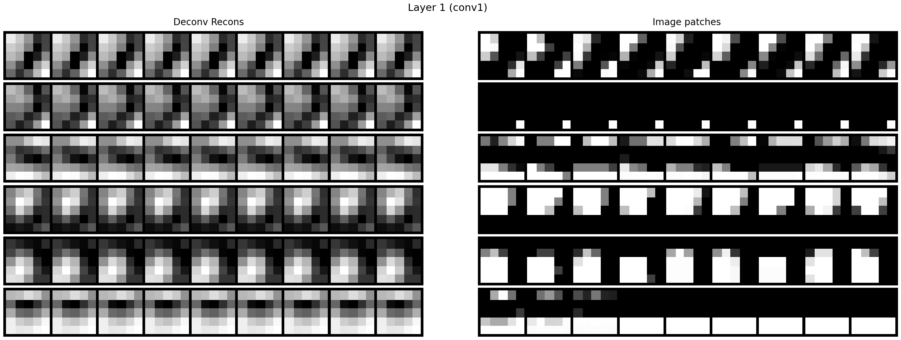
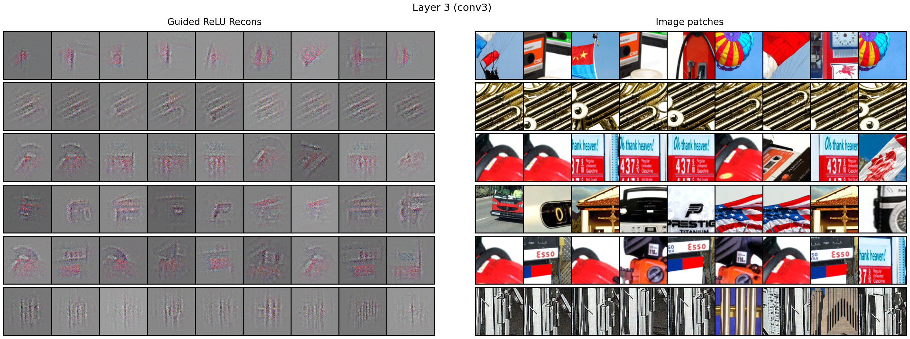

# 🫀 CNN Internals

A reconstruction and visualisation of the internal activations of famous CNN architectures over the years. Activations are projected to pixel space using a Zeiler (2011) deconvolutional netwokr architecture.

## 1) LeNet-5 (1998) – Dataset: MNIST

LeNet-5 is a pioneering convolutional neural network architecture designed by Yann LeCun and colleagues for the purpose of handwritten digit recognition. LeNet-5 was deployed in the banking industry for the autonomous reading of cheques. The network consists of 5 layers with learnable parameters (see notebook for full details).

### Model Architecture

```
LeNet5(
  (conv1): Conv2d(1, 6, kernel_size=(5, 5), stride=(1, 1))
  (tanh1): Tanh(a=1.7159, s=0.6667)
  (pool1): AvgPool2d(kernel_size=2, stride=2)
  (tanh2): Tanh(a=1.7159, s=0.6667)
  (conv2): Conv2d(6, 16, kernel_size=(5, 5), stride=(1, 1))
  (tanh3): Tanh(a=1.7159, s=0.6667)
  (pool2): AvgPool2d(kernel_size=2, stride=2)
  (tanh4): Tanh(a=1.7159, s=0.6667)
  (conv3): Conv2d(16, 120, kernel_size=(5, 5), stride=(1, 1))
  (tanh5): Tanh(a=1.7159, s=0.6667)
  (linear): Linear(in_features=120, out_features=84, bias=True)
  (tanh6): Tanh(a=1.7159, s=0.6667)
  (rbf): RBFOutputLayer()
)
```

### Internal Visualisations

The following images show the internal representations (top 9 activations per feature map for the first 6 channels) learned by each convolutional layer of the LeNet-5 network projected onto pixel space:

#### Convolutional Layer 1 (conv1)

*Filters showing edge detection learned from the digits – Majority of Grad-CAMs focusing on edges.*

#### Convolutional Layer 2 (conv2)  

*Filters showing corner and curve detection.*

#### Convolutional Layer 3 (conv3)

*Filters showing high-level digit-specific features.*

### Key Features

- **Weight Initialisation**: Uses fan-in based uniform initialisation for stable training
- **Activation Function**: Scaled hyperbolic tangent (A=1.7159, S=2/3) for better gradient flow
- **Loss Function**: Custom loss combining correct class penalty with log-sum-exp regularisation
- **RBF Output**: Final layer uses learned prototypes rather than traditional softmax for better generalisation

### Implementation Details

The implementation follows the original LeCun et al. (1998) paper specifications, including:
- Hyperparameters (J=5, A=1.7159, S=2/3)
– Padding of 2 for images (32 x 32)
- Weight initialization schemes
- Custom loss function
- RBF output layer with learnable prototypes


## 2) AlexNet (2012) – Dataset: Imagenette (subset of ImageNet dataset)

AlexNet is a breakthrough convolutional neural network architecture designed by Alex Krizhevsky, Ilya Sutskever, and Geoffrey Hinton. AlexNet is a deep CNN used for image clasification that marked the ascent of the deep learning era. AlexNet won the ILSVRC-2012 competition and achieved a winning top-5 test error rate of 15.3%, compared to 26.2% achieved by the second-best entry. The network consists of 8 layers with learnable parameters (see notebook for full details).

### Model Architecture

```
AlexNet(
  (conv1): Conv2d(3, 96, kernel_size=(11, 11), stride=(4, 4), padding=(2, 2))
  (relu1): ReLU()
  (lrn1): LocalResponseNorm(5, alpha=0.0005, beta=0.75, k=2)
  (pool1): MaxPool2d(kernel_size=3, stride=2, padding=0, dilation=1, ceil_mode=False)
  (conv2): Conv2d(96, 256, kernel_size=(5, 5), stride=(1, 1), padding=(2, 2))
  (relu2): ReLU()
  (lrn2): LocalResponseNorm(5, alpha=0.0005, beta=0.75, k=2)
  (pool2): MaxPool2d(kernel_size=3, stride=2, padding=0, dilation=1, ceil_mode=False)
  (conv3): Conv2d(256, 384, kernel_size=(3, 3), stride=(1, 1), padding=(1, 1))
  (relu3): ReLU()
  (conv4): Conv2d(384, 384, kernel_size=(3, 3), stride=(1, 1), padding=(1, 1))
  (relu4): ReLU()
  (conv5): Conv2d(384, 256, kernel_size=(3, 3), stride=(1, 1), padding=(1, 1))
  (relu5): ReLU()
  (pool3): MaxPool2d(kernel_size=3, stride=2, padding=0, dilation=1, ceil_mode=False)
  (lin1): Linear(in_features=9216, out_features=4096, bias=True)
  (relu6): ReLU()
  (drop1): Dropout(p=0.5, inplace=False)
  (lin2): Linear(in_features=4096, out_features=4096, bias=True)
  (relu7): ReLU()
  (drop2): Dropout(p=0.5, inplace=False)
  (lin3): Linear(in_features=4096, out_features=10, bias=True)
)
```

### Internal Visualisations

The following images show the internal representations (top 9 activations per feature map for the first 6 channels) learned by each convolutional layer of the AlexNet network projected onto pixel space using Guided Backpropagation (Springenberg et al. 2015):

#### Convolutional Layer 2 (conv2)  

*Filters showing straight line and number detection.*

#### Convolutional Layer 3 (conv3)

*Filters showing curved lines and cross-hatch pattern detection.*

#### Convolutional Layer 4 (conv4)

*Filters showing detection of complex combinations of straight and curved lines.*

#### Convolutional Layer 5 (conv5)

*Filters showing high level pattern detection, e.g., dog faces and human hands.*

### Key Features

- **Local Response Normalization (LRN)**: Applied after `relu1` and `relu2` as in the original paper
- **PCA Lighting Noise**: AlexNet-style color lighting augmentation with `alpha=0.1` using dataset PCA (`eigvals`, `eigvecs`)
- **Mean Image Subtraction + 224 crops**: Train uses RandomCropWithMeanSub(224) + horizontal flip; Val uses CenterCropWithMeanSub(224)
- **Receptive-field aligned visualisations**: Top-k activations per map with Guided Backprop patches
- **Regularisation**: Dropout `p=0.5` on the first two fully-connected layers

### Implementation Details

The implementation follows the original Krizhevsky et al. (2012) paper specifications, including:
- Preprocessing of data with mean image and RGB PCA stats; applies `Lighting(0.1, eigvals, eigvecs)`; training set uses `RandomCropWithMeanSub(224)` and random horizontal flip; val uses `CenterCropWithMeanSub(224)`
- Model follow original architecture `conv1` 96×11×11 s4 p2 → LRN → 3×3 s2 maxpool; `conv2` 256×5×5 p2 → LRN → 3×3 s2 maxpool; `conv3` 384×3×3; `conv4` 384×3×3; `conv5` 256×3×3 → 3×3 s2 maxpool; FC: 9216→4096→4096→10 with ReLU and Dropout `p=0.5`
- Normalisation with LRN with `size=5`, `alpha=5e-4`, `beta=0.75`, `k=2`
- Kaiming normal init for Conv/Linear weights; biases zero
- Guided Backprop (Springenberg et al. 2015) with custom ReLU hooks; receptive-field table to crop input-aligned patches; top-k activation tiles per feature map; optional Grad-CAM overlays for `conv5` patches